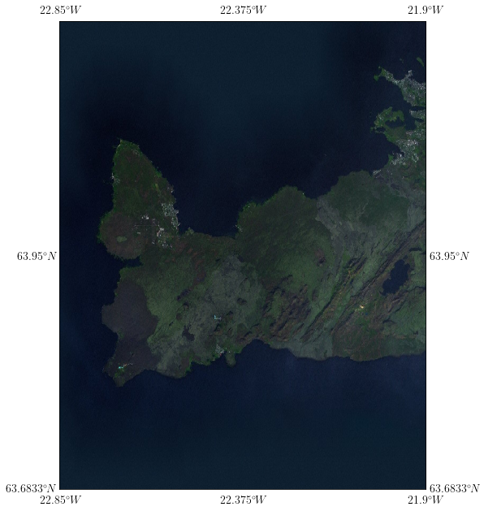

# pyMaps

### Contents
* [Download](#1-download)
* [How to use](#2-how-to-use)

## 1. Download
Execute the next line on your terminal:
```
$ git clone git@github.com:TsspGit/Maps.git
```   
Remember that you need to have a github account, have created an ssh key and, of course, Git on your computer.

## 2. How to use
See the example IslandMap.ipynb. The only requirment is to import the Map class from pyMap.py and obtain the epsg code.

Enjoy it! :)

